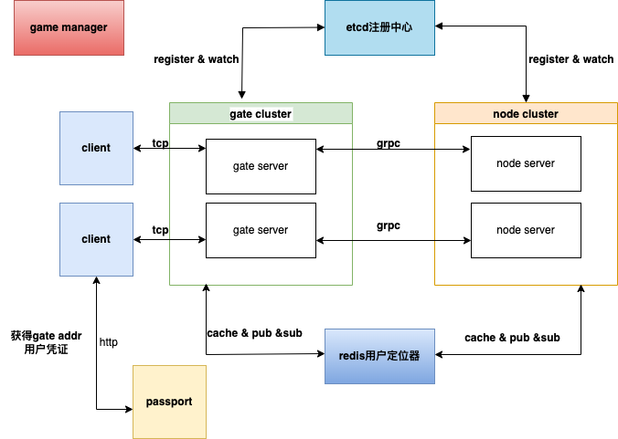

# lori 


[](https://github.com/cr-mao/lorig/actions)
[](https://pkg.go.dev/github.com/cr-mao/lorig)
[](https://opensource.org/licenses/MIT)

### 1.介绍
lorig 是一款基于golang的分布式游戏服务器框架, 是基于 [due](https://github.com/dobyte/due) 进行二次开发的 .




### 2.安装项目和依赖工具
```shell
go get github.com/cr-mao/lorig@v0.0.0
# protobuf 编译
go install google.golang.org/protobuf/cmd/protoc-gen-go@v1.28
# grpc通信
go install google.golang.org/grpc/cmd/protoc-gen-go-grpc@v1.2
```

### 3.功能

- 网关：tcp协议的网关服务器
- 日志：基于zap
- 服务发现注册：基于etcd(todo)
- 协议：支持protobuf、json
- 配置: 基于viper
- 游戏常用技术(见gamelib):异步操作 、定时任务及守护任务 、延迟保存、时间轮

### 4.协议

```text
-------------------------------
| len | seq | route | message |
-------------------------------
```
说明：

1. 使用tcp协议时，为了解决粘包问题，还应在包前面加上包长度len，固定为4字节，默认使用大端序编码
2. seq表示请求序列号，默认为2字节，常用于请求、响应对的确认。可通过配置文件修改
3. route表示消息路由，默认为2字节，不同的路由对应不同的业务处理流程。可通过配置文件修改
4. message表示消息体，采用json或protobuf编码。

#### 心跳

tcp协议时，为了解决粘包问题，还应在包前面加上包长度len，固定为4字节，包长度固定为0。

```text
-------
| len |
-------
|  0  |
-------
```

### doc

[文档](doc/index.md)


### 参考

- [kratos](https://github.com/go-kratos/kratos)
- [zinx](https://github.com/aceld/zinx)
- [iam极客时间go语言项目实战](https://github.com/marmotedu/iam)
